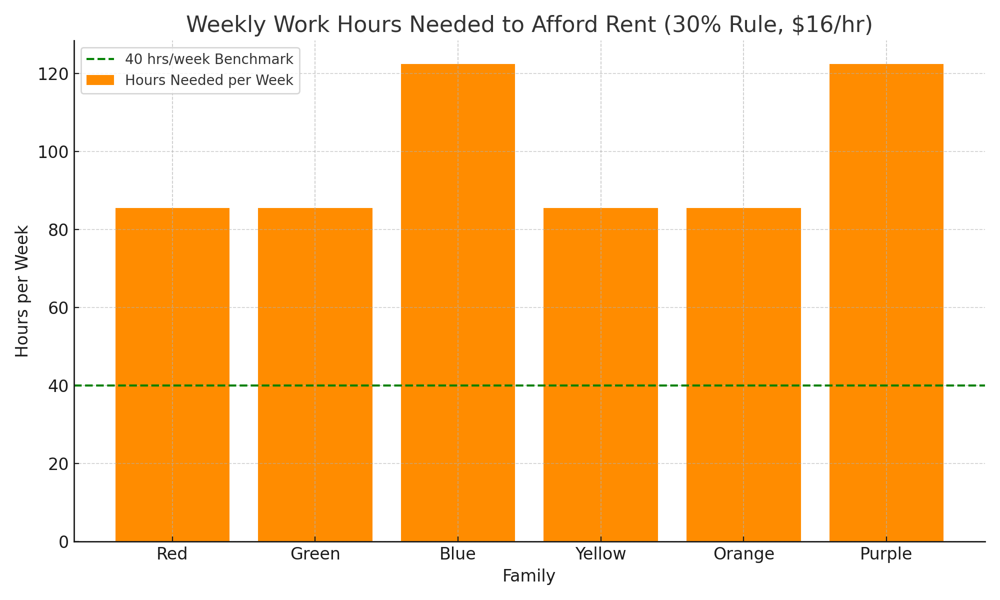

# Housing Affordability Analysis – Living Wage in Los Angeles

This project simulates the financial burden of rent on six different working-class families living in Los Angeles, using realistic income scenarios and the widely accepted 30% income-to-rent affordability rule.

The goal is to assess whether California's minimum wage of $16/hour is sufficient to support affordable housing in LA, and to calculate how many hours each family would need to work weekly to meet that affordability threshold.

##Project Overview

Each family has unique income circumstances, including full-time minimum wage, tipped income, partial employment, and dual-income households. Their rent expectations are based on fair market values for studios and 2-bedroom apartments in the LA area.

The analysis calculates:

- Total monthly income for each family
- The amount of income required for rent to remain at or below 30%
- Whether housing is affordable under current wages
- Weekly work hours required to meet that threshold

##Data Sources

The rent prices, wages, and scenarios were derived from a **Living Wage Fair Housing assignment** from a Math & Social Justice course. They reflect **realistic but synthetic data**, modeled after actual housing conditions and wage structures in Los Angeles County.

- **Wage Source:** California 2024 minimum wage ($16.00/hr)
- **Rent Estimates:** Based on Fair Market Rent values for LA from HUD
- **Scenarios:** Class-provided family profiles simulating real economic challenges

##Financial Modeling Used

- **30% Rule**: Housing is considered affordable if rent is 30% or less of gross monthly income
- **Hourly Wage to Monthly Income Conversion**: `hourly_wage * weekly_hours * 4.33`
- **Affordability Check**: Compares 30% income threshold against actual rent
- **Hours Needed**: Calculates the number of work hours needed to meet the threshold

##Results Summary

- Most families are **unable to afford their expected apartment type** based on minimum wage or current earnings
- Several families would need to work **60–90+ hours/week** to meet the affordability standard
- Only 2 out of 6 families met the 30% guideline
- This reinforces that $16/hour is not enough for fair housing in high-cost areas like LA

##Files Included

- `Housing_Affordability_Analysis.py`: Full Python code used for simulation and visualization
- Chart showing required hours/week for each family to meet the 30% rent rule

##Conclusion

This project highlights how data analysis and basic financial modeling can bring social justice issues into focus. The reality faced by working families in LA reveals a significant gap between policy (minimum wage) and reality (housing costs).

##Screenshot

 

##Tech Stack

- Python 3
- NumPy
- Pandas
- Matplotlib

> Built by Amaan Azim 
